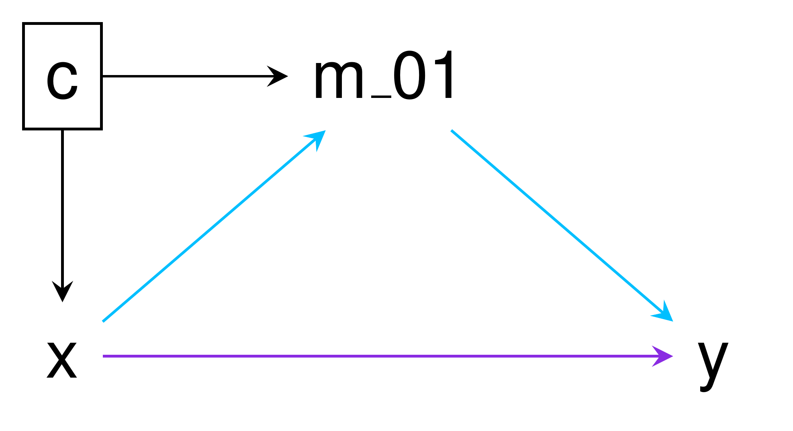

```{r setup, include = FALSE}

knitr::opts_chunk$set(
  collapse = TRUE,
  fig.path = "man/figures/README-",
  out.width = "100%"
)

library(mediator)
```

# mediator 

<!-- badges: start -->
[](https://www.tidyverse.org/lifecycle/#maturing)
[](https://travis-ci.com/GerkeLab/mediator)
[](https://github.com/GerkeLab/mediator/actions?query=workflow%3A%22R+CMD+Check+Windows%2FMacOS%2FUbuntu%22)
[](https://codecov.io/gh/GerkeLab/mediator?branch=master)
<!-- badges: end -->

The goal of `mediator` is to conduct causal mediation analysis under the counterfactual framework, allowing interation between the exposure and mediator ([1](#references)). Currently, `mediator` estimates the controlled direct effect (CDE), natural direct effect (NDE), natural indirect effect (NIE), total effect (TE), and proportion mediated (PM), along with 95% confidence intervals for each. 

## Installation

You can install `mediator` from GitHub with: 

```r
# install.packages("devtools")
devtools::install_github("gerkelab/mediator")
```

<!--- add CRAN once up --->

## Usage 

`mediator` currently implements mediation analyses for binary and continuous exposures/mediators/outcomes, as well as censored time-to-event outcomes. As with all causal inference approaches, estimate validity relies on appropriate assumptions and model specification on the part of the user. 

To demonstrate usage, we consider the `mediation_example` data included with `mediator`. This data set contains exposure/treatment variable `x`  (binary), mediator variables `m` (continuous) and `m_01` (binary), outcome variable `y` (binary), and confounder `c` (continuous).



In the above DAG the path for the NIE is shown in blue while the path for the NDE is in purple. The TE is the combined effect of both the NIE and NDE. When no interaction between the exposure and mediator exists, the CDE and NDE are the same. 

The simplest use case of `mediator` would be as follows:

```{r, example1}


mediator::mediator(data = mediation_example,
                   out.model = glm(y ~ x + m_01 + c + x*m_01, 
                                   family = "binomial",
                                   data = mediation_example),
                   med.model = lm(m_01 ~ x + c, 
                                  data = mediation_example),
                   treat = "x")
```

A data frame (printed to the console if not assigned to an object) is returned containing the point estimates and 95% confidence intervals. 

Since the outcome was a based on a binomial logistic regression, the results from this example are interpreted as a series of odds ratio. When the oucome model is a linear regression, the results are intrepreted as average values. Relative risks can be used for binary outcomes when appropriate and thus intrepreted under that model. 

In this example, based on the CDE, when `m_01` = 1, the effect of `x` on `y` is 0.28; while according to the NDE, when `m_01` is the value observed in the absense of `x` (`x` = 0), the effect of `x` on `y` is 0.52. The NIE tells that the effect of `x` on `y` through `m_01` is 1.06. The TE of `x` on `y` , both direct and indirect, is 0.55. 

Since the TE is the combined effect of the NDE and NIE, statistically significant effects can be observed in opposite directions and result in a TE that is roughly equal to 0. 

## Additional resources 

For an in-depth explanation of mediation analysis or complementary tools for SAS or SPSS users, please check out Linda Valeri and Tyler VanderWeele's paper and  macros, which are available on VanderWeele's [website](https://www.hsph.harvard.edu/tyler-vanderweele/tools-and-tutorials/). 

The parametric model-based approach of `mediator` differs from another R package, [`mediation`](https://cran.r-project.org/web/packages/mediation/vignettes/mediation.pdf), which conducts mediation analysis under a non-parametric framework. 

Additional examples of `mediator` are available under [vignettes](https://github.com/GerkeLab/mediator/tree/tag-edits/vignettes), as well as comparisons of `mediator` and the SAS macro `%mediation`. 

***

### References

1. Valeri, L. and T. J. Vanderweele. 2013. “Mediation analysis allowing for exposure-mediator interactions and causal interpretation: theoretical assumptions and implementation with SAS and SPSS macros.” Psychol Methods 18 (2): 137–50. 
