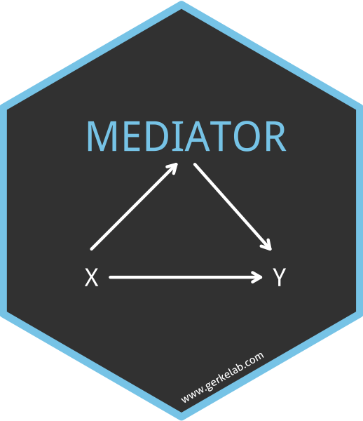
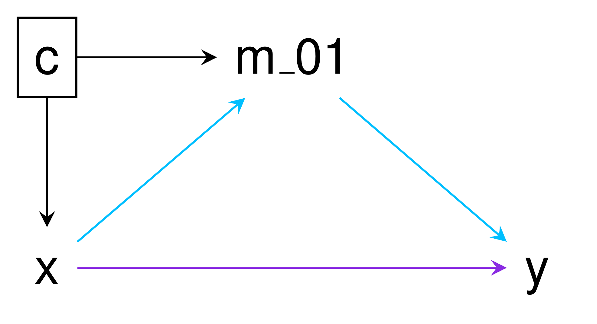

# mediator 

<!-- badges: start -->

[](https://www.tidyverse.org/lifecycle/#maturing)
[](https://travis-ci.com/GerkeLab/mediator)
[](https://github.com/GerkeLab/mediator/actions?query=workflow%3A%22R+CMD+Check+Windows%2FMacOS%2FUbuntu%22)
[](https://codecov.io/gh/GerkeLab/mediator?branch=master)
<!-- badges: end -->

The goal of `mediator` is to conduct causal mediation analysis under the
counterfactual framework, allowing interation between the exposure and
mediator \[Valeri 2013\]. Currently, `mediator` estimates the controlled
direct effect (CDE), natural direct effect (NDE), natural indirect
effect (NIE), total effect (TE) and proportion mediated (PM) and their
95% confidence intervals.

## Installation

You can install `mediator` from github with:

``` r
# install.packages("devtools")
devtools::install_github("gerkelab/mediator")
```

<!--- add CRAN once up --->

## Usage

`mediator` currently implements mediation analysis for dichotomous and
count mediators and outcomes, as well as censored time-to-event
outcomes. Estimate validity assumes proper modeling on the part of the
user.

The following example uses `example250` from within `mediator`, which
was randomly generated, and assumes `x` (binary) is our independent
variable/treatment, `y` (continuous) as our mediator, `cens` (binary) as
our outcome and `c` (continuous) as a confounder that needs to be
adjusted for.



In the above DAG the path for the NIE is shown in blue while the path
for the NDE is in purple. The TE is the combined effect of both the NIE
and NDE. When no interaction between the exposure and mediator exists,
the CDE and NDE are the same.

The simplest use case of `mediator` would be as follows:

``` r
mediator::mediator(data = example250,
                   out.model = glm(cens ~ x + y + c + x*y, 
                                   family = "binomial",
                                   data = example250),
                   med.model = lm(y ~ x + c, 
                                  data = example250),
                   treat = "x")
## # A tibble: 5 x 4
##   Effect              Estimate `Lower 95% CI` `Upper 95% CI`
##   <chr>                  <dbl>          <dbl>          <dbl>
## 1 CDE                    0.428          0.143           1.28
## 2 NDE                    0.715          0.204           2.50
## 3 NIE                    1.07           0.825           1.39
## 4 Total Effect           0.764          0.251           2.33
## 5 Proportion Mediated   -0.210         NA              NA
```

A data frame (printed to the console if not assigned to an object) is
returned containing the point estimates and 95% confidence intervals.

Since the outcome was a based on a binomial logistic regression, the
results from this example are interpreted as a series of odds ratio.
When the oucome model is a linear regression, the results are
intrepreted as average values. Relative risks can be used for binary
outcomes when appropriate and thus intrepreted under that model.

In this example, based on the CDE, when `y` = 1, the effect of `x` on
`cens` is 0.43; while according to the NDE, when `y` is the value
observed in the absense of `x` (`x` = 0), the effect of `x` on `cens` is
0.72. The NIE tells that the effect of `x` on `cens` through `y` is
1.07. The TE of `x` on `cens` , both direct and indirect, is 0.76.

Since the TE is the combined effect of the NDE and NIE, statistically
significant effects can be observed in opposite directions and result in
a TE that is roughly equal to 0.

## Additional resources

For an in-depth explanation of mediation analysis or complementary tools
for SAS or SPSS users, please check out Linda Valeri and Tyler
VanderWeele’s paper and macros, which are available on VanderWeele’s
[website](https://www.hsph.harvard.edu/tyler-vanderweele/tools-and-tutorials/).

The parametric model-based approach of `mediator` differs from another R
package,
[`mediation`](https://cran.r-project.org/web/packages/mediation/vignettes/mediation.pdf),
which conducts mediation analysis under a non-parametric framework.

Additional examples of `mediator` are available under
[vignettes](https://github.com/GerkeLab/mediator/tree/tag-edits/vignettes),
as well as comparisons of `mediator` and the SAS macro `%mediation`.

-----

### References

Valeri, L., and T. J. Vanderweele. 2013. “Mediation analysis allowing
for exposure-mediator interactions and causal interpretation:
theoretical assumptions and implementation with SAS and SPSS macros.”
Psychol Methods 18 (2): 137–50.
